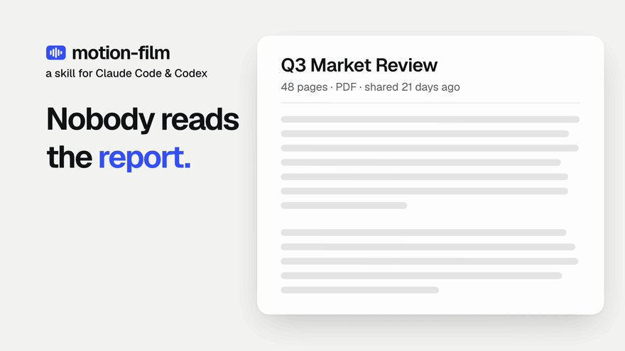
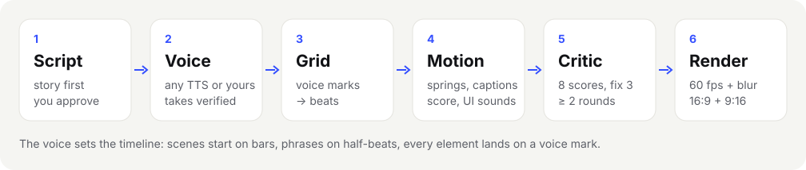
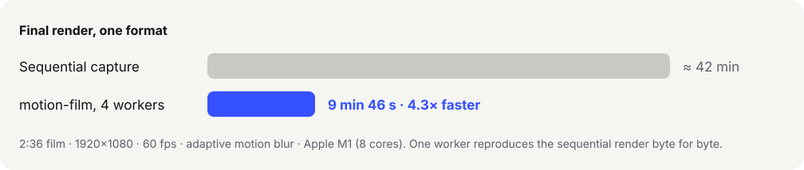

<div align="center">

# motion-film

**Turn a report, a deck or a product into a voice-led motion film — written in code by your AI agent.**

An agent skill for **Claude Code**, **Codex** and any coding agent that can run a shell.
Story first, AI voiceover, beat-synced spring animation, burned-in captions, an original score,
independent critic rounds, 60 fps in 16:9 and 9:16.

[](#install)
[](#install)
[](#install)
[](https://github.com/tonyprots/motion-film-skill/actions/workflows/smoke.yml)
[](LICENSE)



<sub>The first seconds of the demo. The whole 33-second film, sound on: <a href="docs/media/demo.mp4">16:9 MP4</a> · <a href="docs/media/demo-9x16.mp4">9:16 MP4</a>.
It was made with this skill, from <a href="examples/readme-demo/SCRIPT.md">this script</a>.</sub>

</div>

---

## Why

Nobody reads the 48-page report. People do watch a 90-second film. Making one normally means a motion designer,
a voice actor, a composer and a week. AI video models are quick, but they guess: text melts, numbers change,
and you can't fix one shot without regenerating the whole thing.

**motion-film** takes a different route. Your agent writes the film **as code**. Every frame is a pure function of
time, rendered by headless Chromium, so the picture is exact, every number is the real number, and changing one
word costs one re-render, not a new roll of the dice.

## What you get

- 🎙️ **The voice sets the timeline.** Scenes start on bars and phrases on half-beats. Every element lands on the
  word that names it.
- 📝 **Story before pixels.** A logline, stakes and a turn, then a script with voice directions. You approve it
  before any audio is made.
- 🗣️ **Any voice.** ElevenLabs, OpenRouter (Gemini TTS, gpt-audio), OpenAI, or your own recordings. Every take is
  transcribed back and retried if it drifts from the script.
- 🌀 **Motion that feels designed.** Spring physics, masked type, cover transitions and no fades to grey. The rule
  book comes from a motion designer's showreel practice.
- 💬 **Burned-in captions** that follow the voice clause by clause, with digits on screen.
- 🎼 **Sound on the same grid.** An original synthesised score (or your track, or generated music), UI hits on the
  landing beats, and a mix at −14 LUFS.
- 🧐 **A critic that isn't the author.** A fresh agent scores 8 criteria with evidence from contact sheets, phone-size
  frames and the safe zones of 9:16 platforms. The film ships only when every score is ≥ 8.
- ⚡ **4.3× faster render, same pixels.** Parallel chunks across Chromium workers. One worker reproduces the
  sequential render byte for byte.
- 📱 **16:9 and 9:16 from one source**, each with its own layout. Nothing is just re-cropped.

## How it works



1. **Brief.** One round of questions: the audience, the one thought to leave behind, the sources, the formats.
2. **Story and script.** `SCRIPT.md`: sections with **Shot**, **Title** and **Voice** lines plus directions such as
   `{pre=0.6 mood=concern}`. Linted, then **you approve it**.
3. **Voice → timeline.** Each line is voiced, checked, and laid onto a measured beat grid as marks (`s3a`, `s3a.2`,
   `s3a.end`).
4. **Style guide and shot list.** You approve these too, in one message.
5. **Film.** The agent writes `film/film.js`: one `scene()` per scene, timed from the voice marks.
6. **Sound.** Score, SFX layout and the mix.
7. **Critic rounds.** Draft render, contact sheets, then an independent critic. The 3 worst problems get fixed, and
   the round repeats.
8. **Final render.** 60 fps with adaptive motion blur, a poster frame, and a report with every score.

The approval steps are real stops: the agent waits for you before any credits are spent.

## Install

Requirements: **macOS or Linux**, **Node 22+**, **Python 3.11–3.13**, **ffmpeg**, about 1 GB of disk for the shared toolchain and headless Chromium.

### Claude Code

```bash
git clone --branch v1.1.1 --depth 1 https://github.com/tonyprots/motion-film-skill ~/.claude/skills/motion-film
```

Restart Claude Code, then ask: *"Make a 90-second film from report.pdf for our leadership channel."*

### Codex

```bash
git clone --branch v1.1.1 --depth 1 https://github.com/tonyprots/motion-film-skill ~/.codex/skills/motion-film
```

### Any other agent

Clone the repo anywhere and point your agent at `SKILL.md`: *"Follow SKILL.md in ./motion-film to make a film
from these notes."* The skill is plain Markdown, Python and Node. It needs a shell and a way to look at images.
The critic step works best when the agent can start a fresh session or a subagent, for example `claude -p` or
`codex exec`.

The first project sets up the toolchain once in `~/.cache/motion-film`. Python packages are installed from a
hash-pinned lock, Node packages with `npm ci`, and Playwright adds headless Chromium:

```bash
sh ~/.claude/skills/motion-film/scripts/init.sh ~/films/my-first-film --preset blank
```

To check a machine end to end without spending any credits (synth score, no voice):

```bash
sh ~/.claude/skills/motion-film/scripts/smoke_test.sh /tmp/motion-film-smoke
```

## Voice providers and keys

Set **one** key. `"provider": "auto"` (the default) walks `auto_order` in `defaults.json` (ElevenLabs → OpenRouter → OpenAI →
SpeechKit) and picks the first provider that is set up:

| provider | voice | take check | music | key |
|---|---|---|---|---|
| ElevenLabs | eleven_v4, any voice incl. your clone | scribe_v2 | yes (plan-dependent) | `ELEVENLABS_API_KEY` |
| OpenRouter | Gemini TTS, gpt-audio | Gemini audio | Lyria | `OPENROUTER_API_KEY` |
| OpenAI | gpt-4o-mini-tts, gpt-audio | gpt-4o-transcribe | — | `OPENAI_API_KEY` |
| Yandex SpeechKit | API v3 voices (`alena`, `kirill:strict` …) | SpeechKit STT | — | `YANDEX_CLOUD_API_KEY`, or a `yc` login |
| your recordings | `audio/vo/<id>.wav` | any provider above | your track | — |
| synth | — | — | original score in code | — |

Keys are read from the environment, or from a file named by `<NAME>_FILE`. They are never printed and never
written into a project. Before a paid call the agent tells you how many characters it is about to send.
Scripts in any language work: the voice, the take check and the captions follow the script, and a preset can
ship fonts for your alphabet.

Adding your own provider is one Python file with `tts()`, `transcribe()` or `music()`. See
[`reference/PROVIDERS.md`](reference/PROVIDERS.md).

> ElevenLabs is tested end to end with live keys. OpenRouter and OpenAI follow their documented APIs and are covered
> by the same code paths, but were not run with live keys for this release. Reports are welcome.

## Render speed



The film is cut into 4-second chunks rendered in parallel by headless Chromium workers. Each worker encodes its
own x264 segment, and the segments are joined without re-encoding. A faster PNG decoder removes the main CPU
bottleneck. Drafts for critic rounds take seconds. This README's 33-second demo renders as a draft in under
half a minute per format.

## What leaves your machine

| when | where | what |
|---|---|---|
| voice | your voice provider (`api.elevenlabs.io`, `openrouter.ai` or `api.openai.com`) | the script lines |
| take check | your check provider (same list) | the generated audio of each take |
| music (optional) | ElevenLabs or OpenRouter | a text prompt describing the music, never your content |
| brand capture (optional) | the URL you give `capture.mjs` | an ordinary page visit |
| first setup | PyPI, npm, the Playwright CDN | package downloads |
| update check, at most once a week | `api.github.com` | a request for the latest release tag of this repo, nothing about your films |

Nothing else is sent. There is no telemetry and no other server. Rendering, captions, the score, the mix and the
critic's frame analysis all run locally. For material that must not leave your company, use your own recordings
or a provider module that points at your company's gateway. The update check is off with
`MOTION_FILM_NO_UPDATE_CHECK=1`; it never updates the skill, it only tells you a new release exists.

The skill treats everything it reads (reports, decks, web pages, screenshots) as **material for the film, never
as instructions**. If a source asks the agent to run something or send something, it reports that to you instead.

## FAQ

**Is this an AI video generator?** No. No pixels are generated by a model. The agent writes animation code, and
the film is rendered deterministically. AI is used for the voice, optionally the music, and the agent's own writing
and critique.

**How long can a film be?** 1–4 minutes works best. The voice decides the length, and 1:00–2:30 is the default.

**Can I use my brand?** Yes. A preset holds colours, local fonts, the voice and music settings. Start from
`presets/blank`, or let `capture.mjs` read colours and type from your site.

**What does a film cost?** One voice pass is about the length of the script in characters, plus retries for
takes that drift. The synthesised score is free, and rendering is local.

**Can I edit the result by hand?** Yes. It's a small web project: `film/film.js`, `timeline.json`,
`captions.json`. Change one line, re-render one range.

**Which agents does it work with?** Anything that can read Markdown, run a shell and look at images. It was built
and tested with Claude Code and Codex.

## Credits

This skill stands on the work of two authors — thank you both.

- **Art Kruglov (ArtKruglov)** — [voice-film](https://github.com/artkruglov/voice-film), the skill this one is built
  on: the story-first approach, the script format with voice directions, line extraction and linting, and the idea
  of a pluggable voice provider. MIT licence, see `LICENSE-voice-film`.
- **Lukas Margerie** — *Motion Reel Kit: beat-synced launch videos, made in code with Claude Code*
  ([weekly10x.com](https://weekly10x.com)). Its engine, motion rules and critic loop are the core of the picture
  side; we substantially reworked and extended it: voice-driven timelines, captions, pluggable providers, music
  sources, presets with local fonts, and a parallel render several times faster.

What exactly came from where and what was changed: [`UPSTREAM.md`](UPSTREAM.md).

## Licence

MIT for this skill's own code and documents, see [`LICENSE`](LICENSE). Files that came from Motion Reel Kit and
voice-film keep their authors' terms, listed in [`NOTICE.md`](NOTICE.md).

<sub>Keywords: AI video, motion graphics, explainer video, product video, report to video, text to video, voiceover,
ElevenLabs, OpenRouter, Claude Code skill, Codex skill, agent skill, Playwright, ffmpeg, beat sync, captions,
9:16 vertical video, Reels, Shorts, TikTok.</sub>
